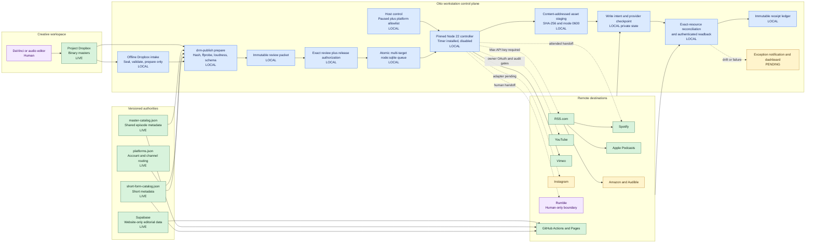
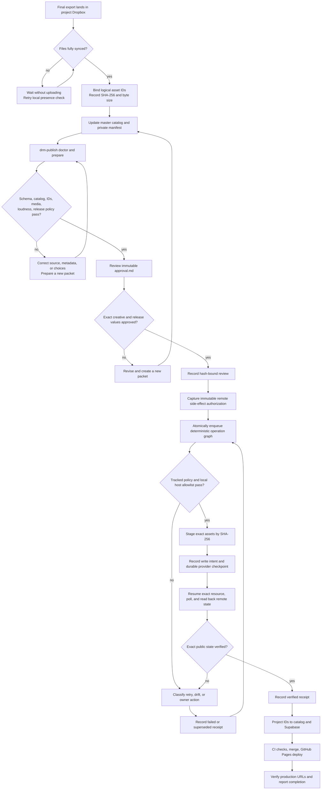
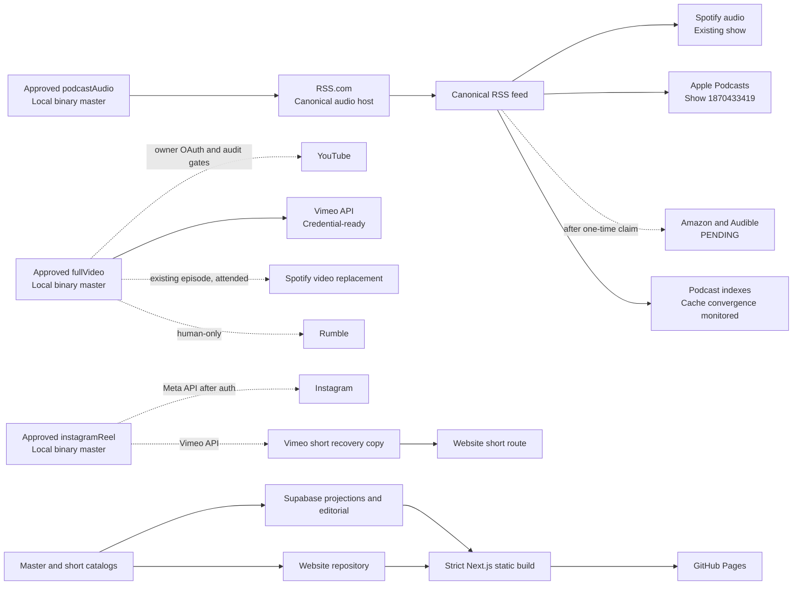
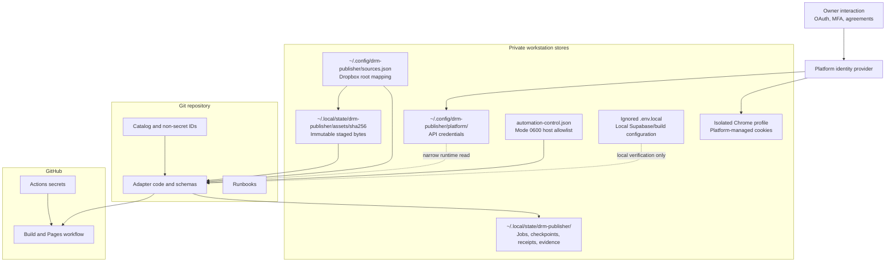
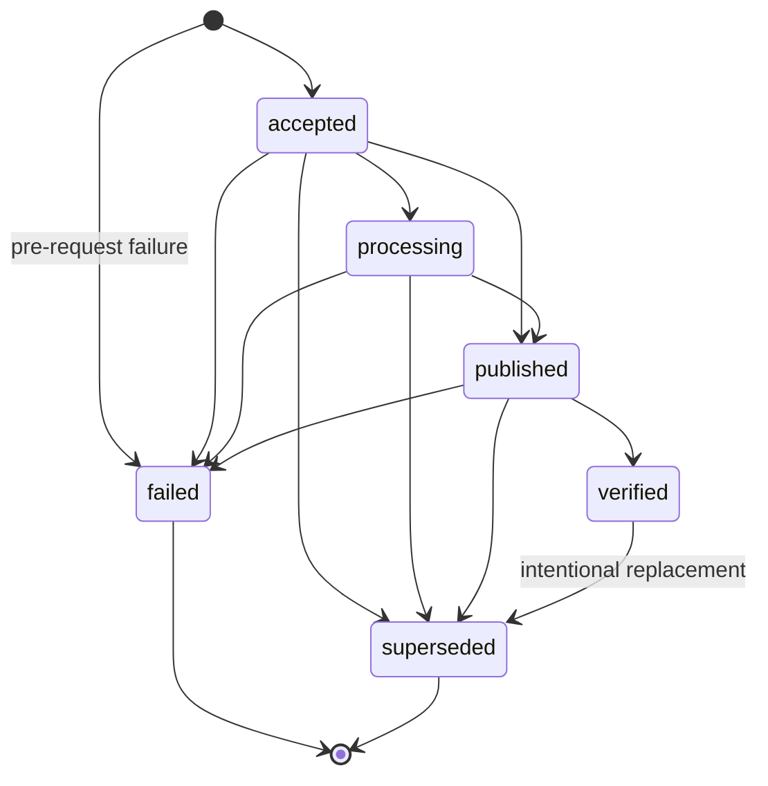
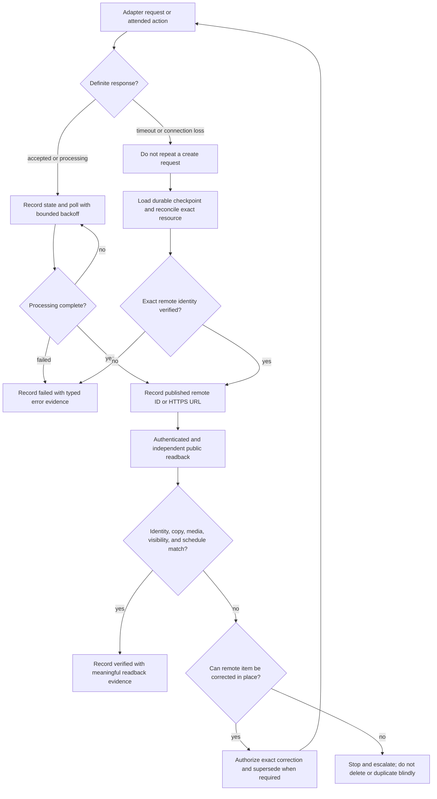
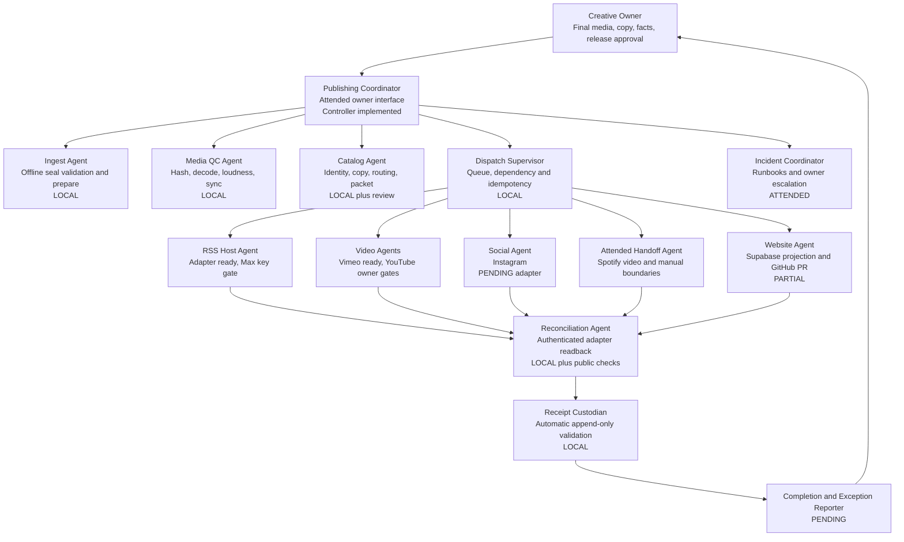
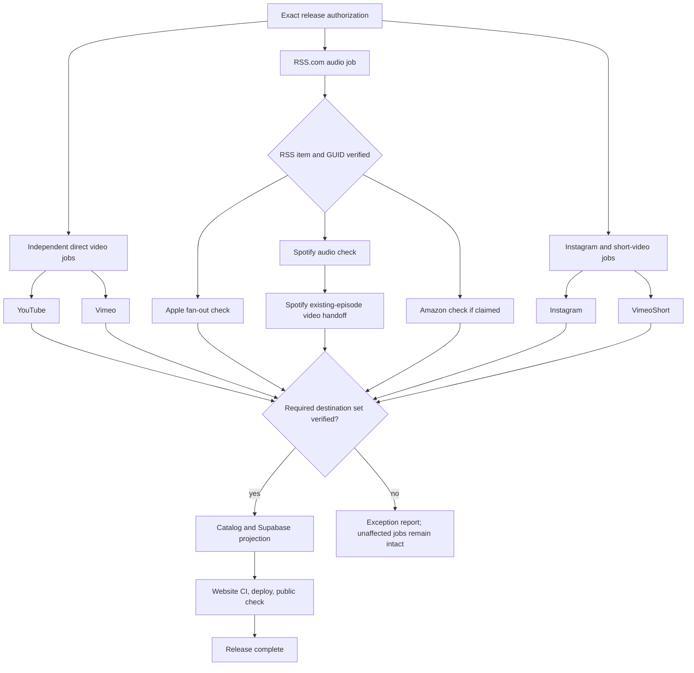

# Publishing Workflow Topology

Last verified: August 8, 2026.

This document explains how one approved Dr. M release moves from an edit on
this workstation to every supported destination. The guarded host control plane
is now implemented: immutable content-addressed asset staging, a durable queue,
exact release authorization, layered host/platform policy gates, official
RSS.com/Vimeo/YouTube adapters, durable provider checkpoints, exact-resource
reconciliation, automatic receipt writes, and a one-minute user timer unit are
present. The timer is intentionally disabled and inactive until the full safety
review and tests are complete. The machine-local host control is fail-closed and
currently reports paused because no control file exists. No real release is
queued and none has been published through this controller.

Start with `docs/operations-manual.md` for current account state and recovery
procedures. Machine-readable catalog, routing, and incident files remain more
authoritative than diagrams in this document.

## Status Legend

| Marker | Meaning |
|---|---|
| `LIVE` | Implemented and used in the current production workflow |
| `LOCAL` | Implemented on this workstation; the marker alone is not evidence that a remote action ran |
| `ATTENDED` | Works only while an operator or assistant is present |
| `PARTIAL` | Some controls exist, but the end-to-end component is incomplete |
| `READY` | Implemented and credentialed, but not yet exercised by an approved production release |
| `PENDING` | Required for the target workflow but not implemented or authorized yet |
| `BLOCKED` | Deliberately stopped until an external dependency or exact approval clears |

The practical automation target is **one creative handoff, one exact release
approval, automated fan-out where official interfaces permit it, and
exception-only human intervention**. It is not fully unattended publishing:
MFA, CAPTCHA, new legal agreements, content-rights statements, and destinations
without a supported publishing API remain human boundaries.

## 1. System Topology

The Ubuntu workstation can be the publishing control-plane host. Dropbox holds
the canonical binaries; this repository holds canonical shared metadata and
routing; private workstation state holds packets, approvals, receipts, and
credentials. External platforms remain the authorities for their returned IDs
and current public state.



The arrows from `Dispatch` are capability paths, not evidence of a release.
`dispatch` only enqueues the exact targets in a valid immutable authorization;
it contacts no platform, and all targets enter one SQLite transaction or none
do. After safety review, the timer can invoke one controller pass at a one-minute
cadence with up to 10 seconds of jitter. It is currently disabled and inactive.
Each controller pass requires a secure running host-control file, its platform
in the local allowlist, the tracked global gate, the tracked per-platform gate
and policy revision, and the immutable authorization. The adapter revalidates
the packet, account identity, copy, and release controls, and the controller
reloads the local host control immediately before each mutating step. The adapter
copies approved bytes into private content-addressed staging and verifies them
again before a provider write. Vimeo is
credential-ready. RSS.com and YouTube stop before a write at their documented
account gates. Instagram has no adapter yet, Spotify video stays attended, and
Rumble is rejected by the controller.

## 2. Authority Boundaries

| Concern | Write authority | Allowed projections | Never infer in reverse |
|---|---|---|---|
| Operating and safety rules | `AGENTS.md` | Runbooks and automation policy | A successful upload is not permission to change policy |
| Shared show and episode identity/copy | `publishing/master-catalog.json` | Episode manifest, Supabase overlap, website, platform copy | Do not make a dashboard or Supabase field a second metadata master |
| Short-form identity/copy | `publishing/short-form-catalog.json` | Vimeo, Instagram, and `/shorts/<slug>/` | A platform filename or caption does not define catalog identity |
| Binary video, audio, artwork | Project Dropbox root, fingerprinted in catalog | Platform uploads and derivatives | Vimeo, YouTube, RSS.com, and Instagram are not binary masters |
| Bytes used by a live adapter | `~/.local/state/drm-publisher/assets/sha256/<prefix>/<sha256>` copied from the approved master | Exact provider upload stream | A mutable Dropbox path is never read as the upload continues |
| Website-only editorial content | Supabase project `tdbsuzciwotleualdcjf` | Static site build | Supabase must not originate shared titles, GUIDs, or destination IDs |
| Podcast enclosure and feed routing | RSS.com, checked against public XML | Spotify, Apple, Amazon, podcast indexes | A directory cache is not the canonical feed |
| Account/show/channel routing | `publishing/platforms.json` | Approval packet and adapter configuration | Do not discover a similarly named channel and publish to it |
| Tracked automation policy | `publishingAutomation.enabled` plus each target's `apiAutomation.enabled` and `policyRevision` in `publishing/platforms.json` | Packet automation-policy snapshot and controller preflight | Credentials or a locally running host cannot open a tracked gate |
| Machine-local automation state | Owner-only `~/.local/state/drm-publisher/automation-control.json` | `paused`/`running` mode, generation, and exact platform allowlist | A tracked policy gate cannot imply that this host is running |
| Release choices | Private episode manifest | Immutable review packet | Prior episode settings do not approve a new episode |
| Local asset/copy review | Hash-bound job packet and `approval.json` | Release-authorization validation | Review alone explicitly authorizes neither upload nor release |
| Remote release decision | Owner-approved `release-authorization.json` bound to packet hashes and exact targets | Durable queue operation bindings | No general instruction, old authorization, or changed packet can authorize a write |
| Remote identity and state | Platform API/dashboard plus independent public readback | Catalog destination fields and receipts | A receipt must not invent an ID or treat a submitted request as verified |
| In-flight provider identity | Private hashed SQLite checkpoint written after provider write intent | Exact adapter reconciliation and immutable receipts | Never repeat a create request merely because its response was lost |
| Website deployment | Git repository, `main`, GitHub Actions | GitHub Pages at `drmexperienced.com` | A passing local dev server is not production evidence |
| Credentials and sessions | Owner-only workstation stores and platform identity providers | Narrow adapter or browser session | No token, cookie, password, or recovery code belongs in the repository |

The reconciliation direction is always **authority to projection**. If a
projection differs, stop and identify which authority is wrong before writing.
Do not copy the newest-looking value across every store.

## 3. Episode Release Flow

### Intended operator experience

1. The editor exports the final full video, podcast audio, thumbnail, captions,
   and optional vertical edit into the project Dropbox structure.
2. The offline intake timer detects a sealed delivery, rehashes every declared
   file, checks exact episode/catalog identity, and invokes only `prepare`.
   Catalog/manifest drafting remains attended; intake never infers identity from
   filenames and has no network access or release authority.
3. Local preparation fingerprints every asset and validates media, catalog,
   release choices, loudness, destination IDs, and routing.
4. The owner reviews one packet containing the exact media hashes, copy,
   visibility, schedule, disclosures, monetization, license, notifications, and
   destinations. `approve` records review only. `authorize` separately creates
   an owner-only, mode-0600 `release-authorization.json` bound to the approval,
   target, asset, copy, and release-plan hashes. Any changed value invalidates
   it.
5. `dispatch` places only those exact authorized targets into the durable queue.
   The complete dependency graph is inserted atomically; a collision or invalid
   dependency rolls the entire enqueue back.
   After safety review, the user timer can run the controller at a one-minute
   cadence with small jitter. It remains disabled and inactive today. A
   controller pass also requires the tracked policy gates and the separate
   mode-0600 host allowlist. Each adapter stages immutable content-addressed
   copies before it creates or publishes through a supported official API.
   Unsupported or unauthenticated actions
   become explicit blocked operations, not silent automation gaps.
6. Before every mutating request, the controller records provider write intent.
   After the provider returns a resumable session or resource identity, it saves
   a hashed, sequenced private checkpoint before proceeding. Platform-specific
   reconcilers resume only that checkpointed resource, read back authenticated
   and public state where applicable, and append immutable receipts.
7. After required remote IDs are verified, catalog projections and Supabase are
   updated, a reviewed commit reaches `main`, and GitHub Actions deploys the
   static site.
8. The owner receives one completion summary or one actionable exception, not
   a series of platform-by-platform prompts.



### What exists at each stage

| Stage | Current implementation | Gap to exception-only operation |
|---|---|---|
| Detect delivery | Offline Dropbox scanner, explicit delivery schema, `READY`-last seal, exact hashes, and idempotent intake claim | Install and exercise the pinned intake timer; catalog/manifest drafting remains attended |
| Validate binaries | `prepare` runs full-file hashing, `ffprobe`, schema checks, and loudness gates | Automatic derivative generation and a structured remediation report |
| Stage upload bytes | All three adapters copy approved regular files into private content-addressed storage, reject symlinks/source mutation, and rehash reused entries | Production exercise and retention/cleanup policy |
| Validate metadata | Master-catalog and manifest drift checks are live | Assisted manifest/catalog drafting without bypassing review |
| Review | Immutable `approval.md`, exact review confirmation, and separate immutable release authorization are live | Small review UI; the two records must retain separate meanings |
| Safety gates | Tracked global and per-platform gates/policy revision plus a separate owner-only local paused/running allowlist | Complete safety review before creating a running control file |
| Queue | Durable node:sqlite queue, atomic dependency-graph enqueue, leases/heartbeats, restart recovery, create-slot uniqueness, and deterministic operation IDs | Operator dashboard and production exercise |
| Upload | RSS.com, Vimeo, and YouTube official adapters enforce account-ID preflight and approved release values | Complete credentials/gates and add Instagram; Spotify video remains attended |
| Poll | Vimeo, YouTube, and RSS adapters poll provider processing | Long-running asynchronous continuation beyond current bounded polls |
| Reconcile | A write-intent marker plus hashed, sequenced private provider checkpoints force exact-resource resume; adapters perform authenticated readback | Independent public/cache checks and catalog projection remain to be automated |
| Receipt | Adapter lifecycle writes are integrated with the immutable receipt state machine; stale locks recover only after age and dead-owner checks | Production exercise against one approved new release |
| Host deployment | Clean Git commit archived into a commit-addressed release, atomically linked, and run with pinned Node 22/build SHA | Run installer after merge; keep timer disabled through full review |
| Website | Strict build and GitHub Pages deployment on `main` are live | Automated reviewed catalog/Supabase projection and post-deploy route checks |
| Notify | Human summary only | Exception inbox plus final release summary |

## 4. Platform Fan-Out

Podcast audio and full video are two different delivery graphs. RSS.com creates
the podcast identity and fans audio out. Direct-video destinations receive the
fingerprinted full-video master or a separately fingerprinted platform
derivative. Never upload fallback podcast audio directly to Apple, Amazon, or
Spotify.



### Current destination capability

| Destination | Current delivery path | Current verified state | Automation state |
|---|---|---|---|
| RSS.com | Upload podcast audio through v4, then verify the episode and public XML | Canonical host; seven normalized enclosures verified; podcast ID `397420` bound | Adapter implemented; `BLOCKED` until Max API entitlement and key are configured; free/manual hosting continues |
| Spotify audio | RSS fan-out | Seven existing identities receive RSS audio | `LIVE` fan-out |
| Spotify video | Replace the RSS-ingested episode through Spotify for Creators | Corrected video verified on all seven existing episode IDs | `ATTENDED`; no supported public creator-upload API in this workflow |
| Apple Podcasts | RSS fan-out to show `1870433419` | Five episodes public; Episodes 1-2 remain a blocked GUID incident | `LIVE` fan-out, incident `BLOCKED` |
| Amazon/Audible | RSS fan-out after claim | No claimed listing ID | One-time claim `PENDING`; future audio fan-out needs no episode upload adapter |
| YouTube | Direct resumable full-video upload | Seven normalized replacements verified; prior seven retained unlisted | Adapter, project, API, desktop client, and production OAuth app configured; owner token `PENDING`; public/unlisted audit `BLOCKED` |
| Vimeo | Direct episode video and short upload/replacement | Seven episodes and three shorts verified | Adapter and private app `540274` are `READY`; account `253415660`, owner-only upload/edit token, and quota were verified |
| Instagram | Direct Reel publish | Creator profile and three Reel mappings verified | Meta app, publishing ID, permissions, and token `PENDING` |
| Website | Supabase plus repository to GitHub Pages | Episode 7 and all three short routes deployed and verified | Build/deploy `LIVE`; content projection still attended |
| Rumble | Direct human browser use | Verified local asset pairs are not submitted | Human-only unless written platform permission changes the boundary |

## 5. Workstation Components

| Component | Location | Role | State |
|---|---|---|---|
| Publisher CLI | `/home/otto/.local/bin/drm-publish` backed by `scripts/publish/` | Doctor, prepare, review, authorize, atomic dispatch, host control, queue, reconcile, retry, audited supersede, receipts, OAuth, migration checks | `LOCAL` |
| Metadata authorities | `publishing/*.json` | Shared metadata, routing, incidents, brand and rollout evidence | `LIVE` |
| Binary source map | `~/.config/drm-publisher/sources.json` | Maps portable `dropbox:` references to the project Dropbox root | `LIVE`, private |
| Job store | `~/.local/state/drm-publisher/jobs/` | Packets, approval records, and immutable receipt files | `LIVE`, private |
| Immutable asset stage | `~/.local/state/drm-publisher/assets/sha256/` | Private SHA-256-addressed copies used by adapters after source-stability and fingerprint checks | `LOCAL`; empty until an adapter stages an approved release |
| Machine host control | `~/.local/state/drm-publisher/automation-control.json` | Owner-only mode, generation, and exact platform allowlist | `BLOCKED`; file absent, therefore fail-closed paused |
| Browser session store | `~/.local/share/drm-publisher/chrome-profile` | Isolated saved sessions for attended work | `ATTENDED`, private |
| Browser wrapper state | `~/.local/state/drm-publisher/browser/` | Narrow bridge state and logs | `ATTENDED`, private |
| API credential store | `~/.config/drm-publisher/` | Vimeo token/app data, YouTube desktop client/token location, future platform keys | `PARTIAL`; Vimeo ready, YouTube owner token absent, RSS key absent; never commit |
| Supabase projection verifier | `scripts/verify-content-catalog.mjs` | Confirms production website rows match catalog identities | `LIVE`, read-only |
| Platform metadata sync helper | `scripts/sync-episodes.mjs` | Reads Vimeo, Spotify, and YouTube metadata into a checked-in aid | `LOCAL`; optional, not publication |
| Static website pipeline | `.github/workflows/deploy.yml` | Tests, strict build, artifact, and GitHub Pages deployment | `LIVE` |
| Control database | `~/.local/state/drm-publisher/control/publisher.sqlite3` | Atomic operation graphs, dependencies, leases/heartbeats, write intent, private hashed provider checkpoints, create slots, results, and audit events | `LOCAL`, mode `0600`, queue empty |
| Pinned host release | `~/.local/share/drm-publisher/releases/<git-sha>/` plus `current` symlink | Clean-commit archive, production dependencies, build SHA, and Node 22 runtime | Installer implemented; redeploy only after merge and review |
| Release controller service | `drm-publisher-controller.service` plus `.timer` | When enabled after safety review, runs one guarded queue pass at a one-minute cadence with up to 10 seconds of jitter and restart persistence | `LOCAL`; installed but disabled and inactive; no real release queued or published |
| Dropbox intake service | `drm-publisher-intake.service` plus `.timer` | Scans sealed bundles every two minutes, with network denied and Dropbox read-only, then invokes only `prepare` | `LOCAL`; implemented and tested, pending pinned host installation |
| Operator inbox/dashboard | Not created | One approval surface, exceptions, and final release report | `PENDING` |

The current local web development server is not a control-plane component. It
uses `.next-dev` so `next dev` does not collide with production `.next` build
artifacts. It remains an ephemeral preview and is never evidence that a website
deployment or platform release succeeded.

## 6. Credential And Session Topology

Credentials must remain segmented by purpose. Platform cookies stay in the
isolated Chrome profile; API tokens stay in owner-only configuration files;
GitHub Actions secrets stay in GitHub; job evidence stays in state storage.



Credential rules:

- Run account tooling as the `otto` desktop user.
- Keep credential directories owner-only and token files mode `0600`.
- Treat a missing, insecure, unreadable, or paused machine-control file as a
  hard pause. A running file allows only its exact platform list and cannot
  override a closed tracked gate.
- Never print tokens in logs, receipts, screenshots, manifests, or chat.
- Never copy cookies or tokens between the DRM and Otto Chrome identities.
- Use browser sessions for attended dashboard work only; an authenticated tab
  is capability, not blanket publishing authorization.
- API adapters must fetch the authenticated immutable account/channel ID and
  compare it with `publishing/platforms.json` before any write.
- A token with broader scopes than required is a configuration fault, not a
  convenience.
- OAuth refresh, MFA, CAPTCHA, identity checks, payment prompts, and changed
  agreements route to the owner and suspend only the affected destination.
- GitHub Actions receives only build/deploy secrets. Platform publishing tokens
  stay on this host unless a separately reviewed deployment architecture moves
  the release controller elsewhere.

## 7. Failure, Retry, And Receipt Paths

Every remote attempt needs a deterministic operation ID. Before every mutating
step, the controller stores provider write intent and the pinned build SHA. Once
the provider returns a session or resource, the controller stores a hashed,
sequenced private checkpoint with its exact identity. A timeout or lost response
is **unknown**, not failed: reconcile only that checkpointed resource so a retry
cannot create a duplicate. A create slot is unique per platform and episode,
including across separate jobs.



`verified` remains the active receipt binding for that destination. Historical
receipt supersession preserves the old remote identity. The CLI command
`supersede` has a narrower purpose: it releases a blocked/failed create slot only
when no provider write intent, checkpoint, acceptance, remote ID, or URL exists.
It requires a reason, evidence, and an exact confirmation phrase and records an
audit event. It can never clear an ambiguous or post-write slot.



Failure classes and required response:

The controller distinguishes definite pre-write failures from post-intent state.
A blocked pre-write operation may use the explicit audited `retry` command. Once
write intent exists, retry is prohibited. Retryable or ambiguous errors with a
valid provider checkpoint enter `waiting` for exact-resource reconciliation;
expired leases follow the same split. If a checkpoint is missing after an
ambiguous create response, blind replay remains blocked.

| Failure | Automatic response | Human or policy boundary |
|---|---|---|
| Dropbox file is online-only, changing, symlinked, or hash-mismatched | Fail staging; never upload; discard only the private incomplete temp copy | Owner confirms the intended render if bytes changed |
| Catalog/manifest drift | Stop and generate a clear diff | Correct the authority, then prepare a new packet |
| Loudness, decode, duration, or media validation failure | Stop before approval | Re-render or explicitly replace the bound binary |
| Missing destination ID or account mismatch | Stop adapter | Owner/account operator resolves the account binding |
| OAuth token expired | Pause only that destination and request reauth | Owner completes OAuth/MFA in the assigned identity |
| API rate limit or processing delay | Pre-write failure may be explicitly retried; checkpointed operations wait and reconcile exact provider state | Escalate after deadline; do not fan out duplicates |
| Request timeout after upload began | Preserve write intent/checkpoint and reconcile the exact remote resource; never repeat create | If identity remains ambiguous, stop for review |
| Stale receipt lock after a process crash | After 15 minutes, recover only when the recorded owner PID is invalid or dead | Never remove a young lock or one owned by a live process |
| Remote metadata drift | Prefer in-place correction after exact authorization | Never recreate stable shows/episodes as a shortcut |
| Public readback differs from authenticated state | Keep receipt below `verified`; retry cache checks | Escalate after the platform's documented window |
| New agreement, rights statement, disclosure, payment, or audience prompt | Suspend destination | Owner supplies the factual/legal attestation |
| Website CI or deploy failure | Preserve last production version and inspect failed check | Merge/retry only after the relevant verification passes |

## 8. Workflow-Agent Organization

These are logical responsibilities for the host, not claims that a fleet of
background agents is currently running. Initially, one supervised assistant can
perform several roles. Durable services should separate them so that no upload
worker can also invent approval or mark itself verified.



### Role contracts

| Role | May do | Must not do |
|---|---|---|
| Creative Owner | Supply final media/copy and attest release facts | Manage each routine dashboard after the system is authorized and healthy |
| Publishing Coordinator | Assemble status, route work, request one exact approval, report exceptions | Treat general intent as approval for changed media or release settings |
| Ingest Agent | Detect complete files and draft logical bindings | Decide that a changed binary is approved |
| Media QC Agent | Hash, decode, inspect, measure loudness/sync, block bad media | Transcode silently and retain the old approval hash |
| Catalog Agent | Generate diffs, validate identity/copy, produce packet | Invent GUIDs, platform IDs, or overwrite website/platform drift blindly |
| Dispatch Supervisor | Enforce dependencies, operation IDs, leases, and duplicate prevention | Publish without a valid exact authorization record |
| Platform Agent | Use one narrow official API/account binding and return raw result evidence | Write another platform, broaden scopes, or call a success `verified` |
| Reconciliation Agent | Read authenticated and public state and compare it with the packet | Trust the dispatch worker's success response alone |
| Receipt Custodian | Validate lifecycle, identity binding, evidence, and append-only writes | Modify old receipts or authorize a remote side effect |
| Website Agent | Project verified IDs, run checks, open a reviewed PR, verify Pages | Publish website references before required destinations are verified |
| Incident Coordinator | Freeze affected paths, preserve evidence, and use focused runbooks | Delete/recreate stable identities to clear a transient problem |

## 9. Dependency Graph And Completion Rule

The release controller must execute dependencies, not merely start every upload
at once.



The exact required destination set must come from the approved manifest, not a
hard-coded global assumption. An audio-only episode must not wait for Spotify
video. A short does not enter the podcast graph. A destination intentionally on
hold does not block completion, but that hold must be visible in the packet.
The strict website verifier now derives required platform references from each
episode's non-null master-catalog destination bindings. Existing Vimeo,
Spotify, YouTube, and Rumble bindings remain exact requirements. A future
episode deliberately recorded with `rumble: null` no longer blocks website
deployment merely because Rumble is outside automation.

A release is complete only when:

1. Every required operation has a `verified` receipt with a stable remote ID or
   URL and meaningful authenticated or public readback evidence.
2. RSS-dependent directories are checked against the same GUID and episode
   identity; a cache delay is reported as pending, not silently treated as a
   failure or a second upload.
3. Shared destination IDs and URLs are reconciled into the master catalog, and
   website-only editorial state is correct in Supabase.
4. The production build and deploy pass, and the relevant public page is checked
   independently.
5. The owner receives a concise release report listing verified destinations,
   intentional holds, unresolved cache propagation, and any manual follow-up.

## 10. Implementation Roadmap

The guarded controller foundation is complete. The remaining work is primarily
one-time account enablement plus adapters and projections that have no usable
credential yet:

| Order | Deliverable | Acceptance condition |
|---|---|---|
| 1 | Exercise the Vimeo path with one approved new release | Exact authorization queues once; account preflight, upload, processing, readback, receipt, and stable ID all verify without a duplicate |
| 2 | Complete YouTube owner OAuth | Channel owner `michaeljameshofer@gmail.com` runs `drm-publish auth youtube`; the saved token reads back exact channel `UCFA1nVv4lKMBlx81gjMAOFQ` |
| 3 | Complete YouTube compliance | Record the applicable audit approval before the controller allows `unlisted` or `public`; private uploads remain separately authorization-bound |
| 4 | Choose RSS.com operating mode | Keep the free plan and attended dashboard, or separately approve Max and configure an API key for the implemented v4 adapter; no upgrade occurs automatically |
| 5 | Implement Instagram after Meta setup | Owner signs into Facebook developer tools, confirms the linked Page/publishing ID and permissions, then the resumable adapter and readback can be completed without changing the Creator account type |
| 6 | Add Spotify-video handoff | Wait for the RSS episode, identify its exact existing ID, guide the attended replacement, and reconcile without duplicate creation |
| 7 | Automate catalog/Supabase projection and site PR | Only verified IDs are written; strict verifier, CI, Pages deploy, and public route check all pass |
| 8 | Add exception inbox and completion report | The owner sees one approval request and only actionable failures thereafter |
| 9 | Deploy and exercise the hardened host | After merge, install the clean commit-addressed Node 22 release and offline intake; verify intake idempotency, staging, atomic enqueue, host/gate pauses, checkpoints, reconciliation, stale-lock recovery, reboot behavior, and one approved real release |

Until the relevant gates pass end to end on a new release, describe the system
as **implemented approval-first publishing automation with platform-specific
holds**, not as 100 percent automated distribution.

## 11. Operator Commands Today

```bash
cd /home/otto/DR-M-Experienced-ops

# Read-only health and configuration checks
/home/otto/.local/bin/drm-publish doctor
/home/otto/.local/bin/drm-publish host status

# Build an immutable local review packet; performs no remote action
/home/otto/.local/bin/drm-publish prepare /absolute/path/to/episode.json

# Review and attest the exact local packet; still grants no upload/release authority
/home/otto/.local/bin/drm-publish show <job-id>
/home/otto/.local/bin/drm-publish approve <job-id> \
  --hash <approval-hash> \
  --by "Otto" \
  --confirm "approve <job-id> <approval-hash>"

# Authorize one immutable target set for remote side effects
/home/otto/.local/bin/drm-publish authorize <job-id> \
  --hash <approval-hash> \
  --by "Otto" \
  --targets "vimeo,youtube,rss.com" \
  --confirm "authorize-release <job-id> <approval-hash> vimeo,youtube,rss.com"

# Queue only that authorized target set; this command contacts no platform
/home/otto/.local/bin/drm-publish dispatch <job-id>
/home/otto/.local/bin/drm-publish queue <job-id>

# Host control is a separate local barrier. Keep it paused during full review.
/home/otto/.local/bin/drm-publish host pause \
  --confirm "pause-publisher"

# Only after review: allow the exact tracked-open platform set.
/home/otto/.local/bin/drm-publish host run \
  --platforms "vimeo" \
  --confirm "run-publisher vimeo"

# The disabled timer would run this same guarded pass after safety review.
/home/otto/.local/bin/drm-publish controller --once

# A post-write operation must resume only its durable provider checkpoint.
/home/otto/.local/bin/drm-publish reconcile <operation-id> \
  --reason "resume exact checkpoint after reviewed interruption" \
  --confirm "reconcile-operation <operation-id>"

# Release a create slot only with proof that no provider write occurred.
/home/otto/.local/bin/drm-publish supersede <operation-id> \
  --reason "replace invalid pre-write job" \
  --evidence "reviewed operation events show no provider write intent" \
  --confirm "supersede-no-remote-write <operation-id>"

# One-time YouTube grant; run in the production channel owner's Google session
/home/otto/.local/bin/drm-publish auth youtube

# Inspect immutable lifecycle evidence (manual receipt remains available for
# an independently observed attended action)
/home/otto/.local/bin/drm-publish receipt <job-id> \
  --platform <platform-id> \
  --operation-id <deterministic-operation-id> \
  --status <accepted|processing|published|verified|failed|superseded> \
  --by <recorder> \
  --confirm "record-receipt <job-id> <platform-id> <approval-hash> <deterministic-operation-id>"

/home/otto/.local/bin/drm-publish receipts <job-id>
/home/otto/.local/bin/drm-publish status <job-id>

# Inspect the host supervisor without changing a release
systemctl --user status drm-publisher-controller.timer
systemctl --user list-timers drm-publisher-controller.timer
```

The production installer, `ops/install-publisher-host.sh`, refuses a dirty
checkout, archives one full Git commit under its SHA, installs production
dependencies with Node `22.22.0`, atomically switches the `current` link, and
pins the service to that release and build SHA. Its default leaves the timer
disabled. Do not use `--enable` until the full review and first controlled
release have passed.

### Final operator experience

The steady-state creative workflow is: export the approved media into one
explicit Dropbox delivery, let the offline intake validate and prepare it,
review one generated packet, and give one exact authorization for its listed
destinations. Once the reviewed local allowlist is running, the host atomically
queues the release, stages immutable approved bytes, handles
supported API uploads, checkpoints provider identities, resumes exact resources,
performs authenticated readback, and writes receipts.
The owner is interrupted only for a changed packet, an account gate, an
unsupported destination, or an ambiguous provider result.

That experience is not fully available across every destination yet. Vimeo is
credential-ready. YouTube needs a one-time OAuth grant from the actual channel
owner and the applicable compliance audit for non-private API uploads. RSS.com
needs a Max entitlement and API key to use its implemented adapter; the free
plan remains usable through the attended dashboard. Instagram needs a Facebook
developer login and linked Page/publishing ID before its adapter can be built.
Amazon needs its one-time RSS claim. Spotify video remains an attended
existing-episode replacement. Apple and Amazon audio remain RSS fan-out and
readback. Rumble remains excluded and untouched. None of these holds weakens or
bypasses the exact authorization required by the ready paths.

Use `docs/new-episode-process.md` for the detailed current release checklist,
`docs/publishing-platform-setup.md` for account setup, and
`docs/operations-manual.md` for incident recovery and current platform state.
